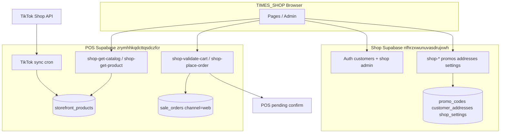
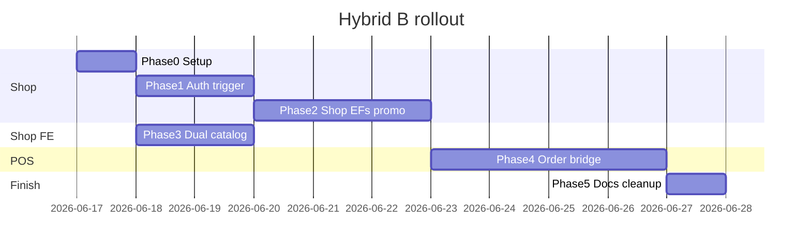

# Hybrid B — แผนแยก Supabase Shop / POS

> **สถานะ:** แผน implement (มิ.ย. 2026)  
> **เป้าหมาย:** ลด egress บน POS project โดยย้าย auth ลูกค้า / admin Shop / โปro / ที่อยู่ / settings ไป Shop project ใหม่ — แต่ **catalog TikTok และ order intake ยังอยู่ POS**  
> **อ้างอิง:** [BACKEND_CONTRACT.md](./BACKEND_CONTRACT.md), [SECURITY.md](./SECURITY.md), [BACKEND_TODO.md](./BACKEND_TODO.md)

---

## สรุปการตัดสินใจ

| รายการ | ค่า |
|--------|-----|
| **Shop Supabase** | `https://nfhrzxwunuvasdrujxwh.supabase.co` |
| **POS Supabase** | `https://zrymhhkqdcttqsdczfcr.supabase.co` (TikTok sync + catalog cache + orders) |
| **Admin Shop** | แยกจาก POS staff — allowlist email **`true.wifi8888@gmail.com`** |
| **Admin bootstrap** | Option A: signup บน Shop + trigger ตั้ง role — **ห้าม** “คนแรก = admin” |
| **Google OAuth** | ยังไม่เปิด — email/password เท่านั้น |
| **Catalog** | TikTok → POS `storefront_products` → **`shop-get-catalog`** / **`shop-get-product`** (browser เรียก POS project) |
| **Orders** | checkout → POS `shop-validate-cart` + `shop-place-order` (ผ่าน bridge ฝั่ง server) |
| **Migrate ลูกค้า** | ไม่ต้อง — POS `auth.users` มีแค่ staff 3 คน, ไม่มี customer, ไม่มี `channel=web` |
| **Supabase Pro** | ยังไม่ upgrade |
| **TIMES_POS repo** | แก้ได้ — migrations + Edge Functions ฝั่ง POS |

---

## สถาปัตยกรรม



**หลักการสำคัญ**

1. **ไม่ duplicate TikTok sync** — sync ครั้งเดียวบน POS → `storefront_products`
2. **Shop browser ใช้ dual Supabase client** — auth/promo ที่ Shop URL, catalog ที่ POS URL
3. **Browser ไม่ถือ POS service role** — checkout bridge ผ่าน Shop Edge Function + server secret
4. **POS staff login ไม่เปลี่ยน** — ยังใช้ POS project เดิม

---

## สถานะปัจจุบัน (ตรวจ มิ.ย. 2026)

### POS project (`zrymhhkqdcttqsdczfcr`)

| มีแล้ว | ยังไม่มี |
|--------|----------|
| `storefront_products` (~2,086 rows) | `sale_orders.customer_user_id` |
| `shop-get-catalog`, `shop-get-product`, `shop-sync-catalog` | `shop-place-order`, `shop-validate-cart` |
| TikTok order poll | `customer_profiles`, `customer_addresses` (ใน POS) |
| | `shop-*` promo / admin functions |

### TIMES_SHOP

| ไฟล์ | สถานะ |
|------|--------|
| `src/lib/config.js` | single `VITE_SUPABASE_*` → ต้องแยก Shop + POS |
| `src/lib/supabase.js` | client เดียว → ต้อง dual client |
| `src/lib/shop-api.js` | promo/shipping → mock localStorage; catalog → POS เมื่อ `USE_MOCK_API=false` |
| `src/context/AuthContext.jsx` | ชี้ Shop project หลัง migrate |

---

## Phase 0 — Shop project setup (Dashboard + env)

**ทำครั้งเดียวบน Shop project**

### 0.1 Auth (Dashboard)

- [ ] เปิด Email provider
- [ ] **ปิด Confirm email** (สมัครแล้วใช้ได้ทันที)
- [ ] **ยังไม่เปิด** Google OAuth

### 0.2 `.env` ใน TIMES_SHOP (ห้าม commit)

```env
# Shop project — auth, promos, addresses, settings
VITE_SUPABASE_URL=https://nfhrzxwunuvasdrujxwh.supabase.co
VITE_SUPABASE_ANON_KEY=<Shop publishable key>

# POS project — catalog read-only (public Edge Functions)
VITE_POS_SUPABASE_URL=https://zrymhhkqdcttqsdczfcr.supabase.co
VITE_POS_SUPABASE_ANON_KEY=<POS anon key>

VITE_USE_MOCK_API=false
VITE_SHOP_NAME=TIMES STORE
# VITE_GOOGLE_REDIRECT_URL=  ← ว่างไว้จนกว่าจะเปิด OAuth
```

### 0.3 Edge Function secrets (Shop project)

| Secret | ใช้ทำอะไร |
|--------|-----------|
| `POS_SERVICE_ROLE_KEY` หรือ dedicated bridge token | Shop EF เรียก POS `shop-validate-cart` / `shop-place-order` |

### 0.4 MCP / tooling

- [ ] สลับ Cursor Supabase MCP ไป Shop project ตอน implement Phase 1–2 (ตอนนี้ชี้ POS)
- [ ] ถ้า publishable key ถูกแชร์ในแชท → **rotate** ใน Dashboard แล้วอัป `.env`

---

## Phase 1 — Shop project: Auth + schema

**Repo:** migrations บน Shop project (MCP `apply_migration` หรือ migration folder)

### 1.1 Trigger `on_auth_user_created`

```sql
-- แนวคิด (ปรับ syntax ตาม migration จริง)
IF lower(new.email) = 'true.wifi8888@gmail.com' THEN
  -- raw_app_meta_data.app_role := 'admin'
ELSE
  -- raw_app_meta_data.app_role := 'customer'
END IF;
```

**กฎ**

- ใช้ `raw_app_meta_data` ไม่ใช่ `user_metadata` ([SECURITY.md §S6](./SECURITY.md))
- allowlist email — **ไม่ใช่** “signup คนแรก = admin”
- email อื่นได้แค่ `customer`

### 1.2 ตาราง Shop-side

| ตาราง | แทนที่ | หมายเหตุ |
|--------|--------|----------|
| `customer_profiles` | — | ชื่อ, เบอร์ (optional) |
| `customer_addresses` | mock addresses | RLS owner only |
| `shop_settings` | localStorage shipping | ค่าจัดส่ง default, บัญชีโอน |
| `promo_codes` | `promo.mock.js` | draft / active / revoked |
| `promo_grants` | distribute logic | per customer หรือ global |

**RLS:** ลูกค้า `auth.uid() = user_id`; admin ผ่าน `app_role` หรือ Edge Functions เท่านั้น

### 1.3 TIMES_SHOP frontend

- [ ] `AuthContext` → Shop Supabase client
- [ ] `/admin/*` เช็ค `app_role IN ('admin')` จาก Shop JWT
- [ ] ซ่อน Google login จน config OAuth

### 1.4 Test Phase 1

1. Signup `true.wifi8888@gmail.com` → `app_role: admin` → เข้า `/admin`
2. Signup email อื่น → `customer` เท่านั้น → redirect ออกจาก admin

---

## Phase 2 — Shop project: Edge Functions

Deploy บน **Shop project** — ย้าย logic จาก `src/mocks/promo.mock.js` + shipping store

| Function | Consumer | หมายเหตุ |
|----------|----------|----------|
| `shop-get-active-promos` | ลูกค้า / guest | โปro ที่แจกแล้ว |
| `shop-admin-promo-list` | `/admin/promos` | |
| `shop-admin-promo-upsert` | editor | |
| `shop-admin-promo-distribute` | distribute sheet | |
| `shop-admin-promo-revoke` | revoke | |
| `shop-admin-list-customers` | targeted distribute | |
| `shop-get-payment-info` | checkout | จาก `shop_settings` |
| `shop-list-addresses` | account | |
| `shop-upsert-address` | account | |
| `shop-delete-address` | account | |
| `shop-admin-get-shop-settings` | `/admin/shipping` | |
| `shop-admin-update-shop-settings` | `/admin/shipping` | |

### TIMES_SHOP changes

- [ ] `shop-api.js` — เรียก Shop URL สำหรับ auth/promo/addresses/settings
- [ ] **เลิก** mock localStorage สำหรับ flow เหล่านี้
- [ ] ลบ `BannerAlert` “บันทึกใน browser ชั่วคราว” เมื่อ API live

### Test Phase 2

1. สร้างโปro draft → แจก → badge บน product card
2. Reload — โปro ยังอยู่ (Shop DB)
3. เปลี่ยนค่าจัดส่ง admin → สะท้อน checkout

---

## Phase 3 — Dual catalog client (TIMES_SHOP + POS CORS)

**ไม่ย้าย catalog ไป Shop project**

### 3.1 TIMES_SHOP

- [ ] ขยาย `src/lib/config.js`:
  - `POS_SUPABASE_URL`, `POS_SUPABASE_ANON_KEY`
- [ ] สร้าง POS catalog client (เช่น `src/lib/pos-supabase.js` หรือ module ใน `shop-api.js`)
- [ ] `getCatalog` / `getProduct` → `invoke` บน **POS URL**
- [ ] Auth JWT เป็น Shop — catalog calls ใช้ POS anon (public EF)

### 3.2 ลด egress (free tier)

- [ ] Client cache catalog (stale 5–15 นาที — React Query หรือ module cache)
- [ ] ไม่ refetch catalog ทุก hot-reload ใน dev
- [ ] pagination / facets ตามเดิม — ไม่ over-fetch

### 3.3 TIMES_POS

- [ ] CORS บน `shop-get-catalog`, `shop-get-product` รับ origin Shop:
  - `https://evasi0m.github.io`
  - `http://localhost:5173` (dev)
- [ ] ยืนยัน `verify_jwt: false` สำหรับ catalog-only (ถ้าปลอดภัยตาม SECURITY)

### Test Phase 3

1. ตั้ง `.env` dual URL → หน้าร้านโหลดสินค้าจาก TikTok cache
2. Network tab: catalog ไป POS domain, auth ไป Shop domain

---

## Phase 4 — POS project: Order bridge (TIMES_POS)

**Repo: TIMES_POS** — งานฝั่ง POS ตาม [BACKEND_TODO.md](./BACKEND_TODO.md) แต่ **ไม่สร้าง** `customer_profiles` / promo บน POS (ย้ายไป Shop แล้ว)

### 4.1 Migration POS

- [ ] `sale_orders`: `customer_user_id`, `web_order_number`, `channel='web'`, shipping/slip columns
- [ ] `web_order_idempotency`
- [ ] Index pending web orders สำหรับ POS queue
- [ ] **ไม่ต้อง** สร้าง `customer_profiles` / `customer_addresses` บน POS (Hybrid B)

### 4.2 Edge Functions POS

| Function | หน้าที่ |
|----------|---------|
| `shop-validate-cart` | อ่าน `storefront_products`, validate ราคา/สต็อก TikTok |
| `shop-place-order` | INSERT `sale_orders` + items; guest + optional Shop user ref |
| `shop-get-my-orders` | ออเดอร์ web ของลูกค้า (link ด้วย `customer_user_id`) |

### 4.3 Shop bridge EF (Shop project)

`shop-place-order` บน **Shop project**:

1. Validate promo ฝั่ง Shop DB
2. Server-side เรียก POS `shop-validate-cart` แล้ว `shop-place-order` (service role)
3. คืน `{ order_id, web_order_number }` ให้ browser

**TIMES_SHOP checkout** เรียก Shop `shop-place-order` — ไม่เรียก POS ตรงจาก browser

### Test Phase 4

1. Guest checkout → order ใน POS queue `channel=web`, `status=pending`
2. Logged-in customer → `customer_user_id` ชี้ Shop user UUID (cross-project ref)
3. POS staff confirm → flow เดิม

---

## Phase 5 — Docs + config cleanup

- [ ] อัปเดต `.env.example` — dual URL, ลบ “same project as POS”
- [ ] อัปเดต `docs/times-shop-handoff/README.md` — อธิบาย Hybrid B
- [ ] อัปเดต `.cursor/rules/times-shop.mdc` — Shop DB แยก; catalog/order bridge
- [ ] อัปเดต `BACKEND_TODO.md` — แยกงาน Shop vs POS ชัด
- [ ] บันทึกใน `BACKEND_CONTRACT.md` ว่า function ไหน deploy ที่ project ไหน (ถ้าจำเป็น)

---

## ลำดับ rollout แนะนำ



| Milestone | Phase | ใช้งานได้ |
|-----------|-------|-----------|
| **MVP เร็ว** | 0 + 1 + 3 | Auth แยก + catalog TikTok + admin login |
| **โปro จริง** | + 2 | โปro/settings ใน Shop DB |
| **Checkout จริง** | + 4 | สั่งซื้อ → POS queue |

---

## Test plan รวม (E2E)

- [ ] Admin signup allowlist → `/admin` ใช้ได้
- [ ] Customer signup → ไม่เข้า admin
- [ ] Catalog จาก POS TikTok cache
- [ ] สร้าง/แจกโปro → badge Shopee-style บน product card
- [ ] Checkout → POS pending queue
- [ ] POS staff ไม่กระทบ — login POS project เดิม

---

## ขอบเขตที่ไม่ทำในรอบนี้

- Google OAuth
- Supabase Pro upgrade
- Duplicate TikTok sync ไป Shop
- Migrate ลูกค้า (ไม่มีอยู่แล้ว)
- Payment slip OCR

---

## ความเสี่ยงและ mitigation

| ความเสี่ยง | Mitigation |
|-----------|------------|
| Catalog ยังกิน egress POS | client cache + public catalog EF |
| Service role leak | Edge Function secrets เท่านั้น |
| Random user เป็น admin | email allowlist ใน trigger |
| Dual project สับสน | แยก module ชัด: `shop-supabase` vs `pos-catalog` |
| Cross-project user ref | เก็บ Shop `auth.users.id` ใน `customer_user_id` (UUID string) |

---

## Checklist สำหรับคุณ (ก่อนเริ่ม implement)

- [ ] สร้าง `.env` ด้วย Shop URL + key (rotate ถ้าเคยแชร์)
- [ ] ยืนยัน path TIMES_POS ในเครื่อง (สำหรับ Phase 4)
- [ ] สลับ Supabase MCP ไป Shop project เมื่อพร้อม Phase 1
- [ ] Signup `true.wifi8888@gmail.com` **หลัง** deploy trigger Phase 1

---

## ไฟล์ TIMES_SHOP ที่จะแตะ (reference)

| ไฟล์ | Phase |
|------|-------|
| `src/lib/config.js` | 3 |
| `src/lib/supabase.js` | 1, 3 |
| `src/lib/shop-api.js` | 2, 3, 4 |
| `src/context/AuthContext.jsx` | 1 |
| `src/pages/admin/*` | 2 |
| `.env.example` | 5 |
