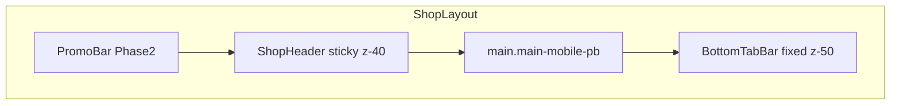
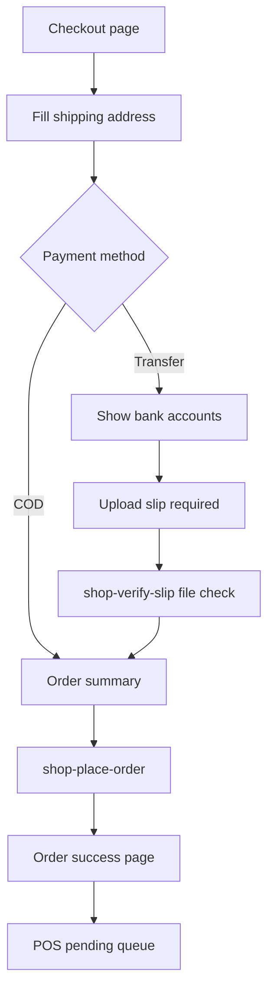

# TIMES STORE — Design System (SHOP_DESIGN_SYSTEM)

> **Single source of truth** สำหรับ UX/UI ของ TIMES_SHOP  
> Theme: **Champagne Luxe** — cream canvas, coral accent, Taviraj serif  
> MVP: **light theme only** · Admin: TikTok Glass subset  
> อัปเดต: มิ.ย. 2026 · Contract v1.0

---

## สารบัญ

1. [Design Principles](#1-design-principles)
2. [Design Tokens](#2-design-tokens)
3. [Typography](#3-typography)
4. [Layout Shell](#4-layout-shell)
5. [Components — Actions](#5-components--actions)
6. [Components — Surfaces & Cards](#6-components--surfaces--cards)
7. [Components — Forms](#7-components--forms)
8. [Components — Feedback & Utility](#8-components--feedback--utility)
9. [Page Templates](#9-page-templates)
10. [Checkout & Payment UX](#10-checkout--payment-ux)
11. [Admin Zone](#11-admin-zone)
12. [Implementation Guide](#12-implementation-guide)

---

## 1. Design Principles

### 1.1 บุคลิกแบรนด์

| หลักการ | รายละเอียด |
|---------|------------|
| **Consumer-first** | เน้นรูปสินค้า + ราคา — ไม่ใช่ dense data table แบบ POS |
| **Champagne Luxe** | พื้น cream อบอุ่น, card แก้ว frost, accent coral นุ่ม |
| **Mobile-first** | ลูกค้าส่วนใหญ่ใช้มือถือ — bottom nav, sticky CTA, touch 44px |
| **ภาษาไทย** | UI copy ไทย · ชื่อสินค้าตาม TikTok (อาจมี EN) |
| **Trust & clarity** | แสดง "ส่งฟรี", สถานะสลิป, ราคาก่อนชำระชัดเจน |

### 1.2 สิ่งที่ห้าม

- Sidebar nav แบบ POS
- แสดง `cost_price`, seller internal SKU, margin
- Hardcode hex กระจาย — ใช้ CSS variables / Tailwind tokens
- `alert()` / `confirm()` native browser
- Font body < 14px บน mobile
- Dark mode ใน MVP (Phase 2)

### 1.3 Brand

- **ชื่อร้าน:** TIMES STORE (text logo จนกว่ามี asset)
- **Logo:** placeholder — `.font-display text-2xl text-ink tracking-tight`

---

## 2. Design Tokens

คัดลอกจาก [`src/styles.legacy.css`](../../src/styles.legacy.css) `:root` (light theme) + [`tailwind.config.js`](../../tailwind.config.js)

### 2.1 Color — Semantic (RGB triplet → Tailwind)

| Token CSS | RGB | Hex | Tailwind class |
|-----------|-----|-----|----------------|
| `--c-primary` | 204 111 84 | `#cc785c` | `bg-primary`, `text-primary`, `border-primary` |
| `--c-primary-active` | 164 76 55 | `#a44c37` | `bg-primary-active` |
| `--c-primary-disabled` | 226 216 204 | `#e2d8cc` | `bg-primary-disabled` |
| `--c-ink` | 30 28 25 | `#1e1c19` | `text-ink` |
| `--c-body` | 65 59 51 | `#413b33` | `text-body` |
| `--c-body-strong` | 42 38 33 | `#2a2621` | `text-body-strong` |
| `--c-muted` | 112 101 87 | `#706557` | `text-muted` |
| `--c-muted-soft` | 150 137 119 | `#968977` | `text-muted-soft` |
| `--c-hairline` | 221 210 194 | `#ddd2c2` | `border-hairline` |
| `--c-hairline-soft` | 233 225 213 | `#e9e1d5` | `border-hairline-soft` |
| `--c-canvas` | 248 244 236 | `#f8f4ec` | `bg-canvas` |
| `--c-surface-soft` | 244 238 228 | `#f4eee4` | `bg-surface-soft` |
| `--c-surface-card` | 238 229 216 | `#eee5d8` | `bg-surface-card` |
| `--c-surface-cream-strong` | 229 217 199 | `#e5d9c7` | `bg-surface-cream-strong` |
| `--c-surface-strong` | 255 253 248 | `#fffdf8` | `bg-surface-strong` |
| `--c-nightshade` | 24 23 21 | `#181715` | `bg-nightshade` (toast) |
| `--c-on-primary` | 255 255 255 | `#ffffff` | `text-on-primary` |
| `--c-accent-teal` | 82 168 153 | `#52a899` | `text-accent-teal` |
| `--c-accent-amber` | 213 154 70 | `#d59a46` | `text-accent-amber`, warnings |
| `--c-success` | 76 153 119 | `#4c9977` | `text-success`, `bg-success` |
| `--c-warning` | 196 133 41 | `#c48529` | `text-warning` |
| `--c-error` | 199 70 70 | `#c74646` | `text-error`, `bg-error` |

### 2.2 Glass surfaces

| Token | Value | ใช้ |
|-------|-------|-----|
| `--glass-bg` | `rgba(255,253,248,0.78)` | secondary buttons, overlays |
| `--glass-bg-strong` | `rgba(255,253,248,0.94)` | `.btn-secondary` |
| `--glass-border` | `rgba(174,155,128,0.32)` | card/button borders |
| `--glass-border-cream` | `rgba(174,155,128,0.34)` | `.card-cream` |

### 2.3 Elevation (shadows)

| Token | ใช้ |
|-------|-----|
| `--shadow-low` | cards, inputs, secondary buttons |
| `--shadow-mid` | hover lift, dropdowns |
| `--shadow-high` | modals, sticky bars |

```css
--shadow-low:  0 1px 0 var(--rim-top) inset, 0 -1px 0 var(--rim-bot) inset,
               0 5px 16px -6px rgb(var(--shadow-rgb) / 0.10);
--shadow-mid:  0 1px 0 var(--rim-top-strong) inset, 0 -1px 0 var(--rim-bot-mid) inset,
               0 12px 30px -10px rgb(var(--shadow-rgb) / 0.16);
```

### 2.4 Body background

```css
body {
  background: var(--body-mesh), rgb(var(--c-canvas));
  color: rgb(var(--c-ink));
}
```

### 2.5 Border radius

| Token | px | Tailwind |
|-------|-----|----------|
| xs | 4 | `rounded-xs` |
| sm | 6 | `rounded-sm` |
| md | 8 | `rounded-md` |
| lg | 12 | `rounded-lg` |
| xl | 16 | `rounded-xl` |
| control | 10–11 | inputs, primary buttons |
| card | 14 | `.card-canvas` |
| pill | 9999 | badges, pills |

### 2.6 Motion

| Token | Value |
|-------|-------|
| `--ease-out` | `cubic-bezier(.2,.7,.2,1)` |
| hover lift | `transform: translateY(-1px)` |
| active press | `transform: scale(0.98)` |
| transition | `0.15s var(--ease-out)` (buttons), `0.2s` (shadows) |

### 2.7 Spacing scale (Shop-specific)

| Token | Value | ใช้ |
|-------|-------|-----|
| `--shop-page-px` | 16px mobile / 24px lg | horizontal padding |
| `--shop-section-gap` | 24px mobile / 32px desktop | between sections |
| `--shop-card-gap` | 12px mobile / 16px desktop | product grid gap |
| `--mobile-tabbar-h` | 64px | bottom nav height |
| `--mobile-clearance` | tabbar + safe-area | main padding-bottom |

### 2.8 Z-index stack

| Layer | z-index | ใช้ |
|-------|---------|-----|
| base | 0 | content |
| sticky header | 40 | ShopHeader |
| bottom nav | 50 | BottomTabBar |
| overlay | 60 | modal backdrop |
| modal / toast | 70 | Modal, Toast |
| admin drawer | 80 | admin filters |

---

## 3. Typography

**Font family:** `'Taviraj', 'Cormorant Garamond', serif` (Google Fonts)

```html
<link href="https://fonts.googleapis.com/css2?family=Taviraj:wght@400;500;600;700&display=swap" rel="stylesheet">
```

### 3.1 Type scale

| Role | Size | Weight | Line | Class / usage |
|------|------|--------|------|---------------|
| Store logo | 24px / 28px desktop | 600 | 1.1 | `.font-display text-2xl lg:text-3xl` |
| Page title | 28px / 36px desktop | 600 | 1.1 | `.font-display text-3xl lg:text-4xl` |
| Section title | 20px | 600 | 1.2 | `.font-display text-xl` |
| Product name | 16px | 600 | 1.35 | `text-base font-semibold line-clamp-2` |
| SKU / variant | 13px | 400 | 1.3 | `text-sm text-muted` |
| Price (emphasis) | 18–22px | 700 | 1.2 | `text-lg font-bold text-primary` |
| Body | 15–16px | 400 | 1.5 | `text-base text-body` |
| Label | 14px | 600 | 1.3 | `text-sm font-semibold text-body-strong` |
| Caption | 12px | 500 | 1.3 | `text-xs text-muted` |
| Micro / legal | 11px | 400 | 1.3 | `text-[11px] text-muted-soft` |
| Button | 15px | 500 | 1 | `.btn-*` font-size 15px |

### 3.2 Price formatting

ใช้ `fmtTHB(n)` จาก pattern [`src/lib/money.js`](../../src/lib/money.js):

- `12900` → `฿12,900`
- ไม่มีทศนิยมสำหรับราคาปลีก

### 3.3 Thai copy tone

- สั้น เป็นกันเอง สุภาพ: "เพิ่มลงตะกร้า", "ยืนยันสั่งซื้อ", "ส่งฟรี"
- หลีกเลี่ยง jargon: ใช้ "รอยืนยัน" ไม่ใช่ "pending"

---

## 4. Layout Shell

### 4.1 Architecture



### 4.2 ShopLayout

```jsx
// Pseudocode structure
<div className="min-h-screen bg-canvas">
  <PromoBar />           {/* Phase 2 — optional */}
  <ShopHeader />
  <main className="main-mobile-pb max-w-[1200px] mx-auto px-4 lg:px-6 py-4 lg:py-8">
    {children}
  </main>
  <BottomTabBar />       {/* hidden on /checkout, /auth/*, /admin/* */}
</div>
```

**Routes ที่ซ่อน bottom nav:** `/checkout`, `/auth/*`, `/admin/*`

### 4.3 ShopHeader

| Property | Spec |
|----------|------|
| Height | 56px mobile / 64px desktop |
| Background | `bg-canvas/90 backdrop-blur-md border-b border-hairline-soft` |
| Position | `sticky top-0 z-40` |
| Left | "TIMES STORE" `.font-display text-xl font-semibold text-ink` |
| Center (md+) | optional SearchBar compact |
| Right | Cart icon + badge count, Account icon (logged out) |

**Cart badge:** coral circle, min 18px, white text, count max "99+"

### 4.4 BottomTabBar

| Tab | Icon | Label | Route |
|-----|------|-------|-------|
| 1 | home | หน้าแรก | `/` |
| 2 | grid | สินค้า | `/catalog` |
| 3 | cart | ตะกร้า | `/cart` |
| 4 | user | บัญชี | `/account` |

| Property | Spec |
|----------|------|
| Height | `--mobile-tabbar-h: 64px` + `env(safe-area-inset-bottom)` |
| Background | `bg-surface-strong/95 backdrop-blur-lg border-t border-hairline` |
| Active tab | `text-primary` + 2px top coral indicator |
| Inactive | `text-muted` |
| Touch | min 44×44 per tab |

### 4.5 PageContainer & SectionHeader

```jsx
<section className="space-y-4 lg:space-y-6">
  <SectionHeader title="สินค้าแนะนำ" action={{ label: 'ดูทั้งหมด', href: '/catalog' }} />
  ...
</section>
```

- **SectionHeader:** flex justify-between, title `font-display text-xl`, link `text-sm text-primary`

### 4.6 Grid breakpoints

| Breakpoint | Product grid | Catalog columns |
|------------|--------------|-----------------|
| `< md` | 2 columns | 2 |
| `md` | 3 columns | 3 |
| `lg` | 4 columns | 4 |

`gap: gap-3 md:gap-4`

---

## 5. Components — Actions

Map จาก POS classes → React `ShopButton` variants

### 5.1 ButtonPrimary (`.btn-primary`)

**ใช้:** "เพิ่มลงตะกร้า", "ยืนยันสั่งซื้อ", "สมัครสมาชิก"

| Property | Value |
|----------|-------|
| Background | `linear-gradient(180deg, #d18467 0%, #cc785c 50%, #c06c50 100%)` |
| Color | `#fff` |
| Min height | 44px |
| Padding | `12px 22px` |
| Radius | 11px |
| Font | 15px, weight 500 |
| Border | `1px solid rgba(255,255,255,0.18)` |
| Shadow | inset gloss + `0 6px 16px -4px rgba(204,120,92,0.5)` |
| Hover | `brightness(1.05) translateY(-1px)` |
| Active | `scale(0.98) brightness(0.95)` |
| Disabled | `bg-primary-disabled text-muted`, no shadow |
| Full width | `w-full` on mobile checkout CTA |

```jsx
<button className="btn-primary w-full">ยืนยันสั่งซื้อ</button>
```

### 5.2 ButtonSecondary (`.btn-secondary`)

**ใช้:** "ดูตะกร้า", secondary actions

| Property | Value |
|----------|-------|
| Background | `var(--glass-bg-strong)` + blur 18px |
| Border | `1px solid var(--glass-border)` |
| Shadow | `var(--shadow-low)` |
| Min height | 44px |

### 5.3 ButtonOutline (shop-specific)

**ใช้:** "ดูเพิ่มเติม", tertiary on cream bg

```css
.btn-outline {
  background: transparent;
  color: rgb(var(--c-primary));
  border: 1.5px solid rgb(var(--c-primary));
  min-height: 44px;
  padding: 12px 22px;
  border-radius: 11px;
  font-weight: 500;
  font-size: 15px;
}
.btn-outline:hover {
  background: rgb(var(--c-primary) / 0.08);
}
```

### 5.4 ButtonGhost (`.btn-ghost`)

**ใช้:** "ลบ", icon labels, nav text links

| Property | Value |
|----------|-------|
| Background | transparent |
| Min height | 38px (icon row) / 44px (touch row) |
| Padding | `8px 14px` |
| Radius | 9px |
| Hover | `bg-surface-card/70` |

### 5.5 ButtonDanger (`.btn-danger` pattern)

**ใช้:** admin ปฏิเสธสลิป, ลบที่อยู่

- Background: error gradient or `bg-error`
- Color: white
- Same geometry as primary (44px, radius 11px)

### 5.6 IconButton

| Property | Value |
|----------|-------|
| Size | 44×44px |
| Radius | 11px |
| Use | qty +/-, close modal, header icons |
| Hover | ghost background |

### 5.7 Button loading state

- Replace label with spinner 20px + "กำลังดำเนินการ..."
- `disabled` + `opacity-80 pointer-events-none`

### 5.8 LinkButton

- Text only: `text-primary text-sm font-medium underline-offset-2 hover:underline`
- ใช้: "ดูทั้งหมด", "แก้ไข", "ลืมรหัสผ่าน?"

---

## 6. Components — Surfaces & Cards

### 6.1 CardCanvas (`.card-canvas`)

**ใช้:** checkout sections, order summary, auth card

| Property | Value |
|----------|-------|
| Background | warm white glass mesh (see POS styles) |
| Backdrop | blur 20px saturate 140% |
| Border | `1px solid var(--glass-border)` |
| Radius | 14px |
| Shadow | `var(--shadow-low)` |
| Padding | `p-4 lg:p-6` |

### 6.2 CardCream (`.card-cream`)

**ใช้:** nested groups inside checkout, admin sub-panels on cream

- Deeper cream tone than canvas — clearly distinct
- Same radius 14px, padding `p-4`

### 6.3 ProductCard

```
┌─────────────────────────┐
│  ┌───────────────────┐  │
│  │                   │  │
│  │     image 1:1     │  │
│  │                   │  │
│  └───────────────────┘  │
│  [ส่งฟรี]  (optional)   │
│  Product Name line 1    │
│  line 2 clamp           │
│  SKU variant · muted    │
│  ฿12,900    [+] icon    │
└─────────────────────────┘
```

| Part | Spec |
|------|------|
| Wrapper | `card-canvas p-3 flex flex-col gap-2 hover-lift cursor-pointer` |
| Image | `aspect-square rounded-lg object-cover bg-surface-soft` |
| Name | `text-base font-semibold line-clamp-2 text-ink` |
| SKU | `text-sm text-muted truncate` |
| Price | `text-lg font-bold text-primary` |
| Add btn | IconButton 36px coral or full "เพิ่ม" on PDP only |

**States:**

| State | Visual |
|-------|--------|
| `in_stock` | normal |
| `low_stock` (≤3) | caption `text-warning` "เหลือ n ชิ้น" |
| `out_of_stock` | image `opacity-50`, overlay badge "สินค้าหมด", CTA disabled |

### 6.4 ProductCardSkeleton

- Same dimensions as ProductCard
- Image area: `animate-pulse bg-surface-card rounded-lg aspect-square`
- 3 text bars: 80%, 60%, 40% width

### 6.5 CartLineItem

```
┌──────────────────────────────────────────────┐
│ [thumb 72px]  Product Name                   │
│               SKU variant                    │
│               ฿12,900 × 2        [−] 2 [+]  🗑 │
└──────────────────────────────────────────────┘
```

| Part | Spec |
|------|------|
| Container | `card-canvas p-3 flex gap-3` |
| Thumb | 72×72 rounded-md object-cover |
| Qty stepper | IconButton − / + flanking count |
| Line total | `font-semibold text-ink` right aligned |
| Remove | ghost icon trash |

### 6.6 OrderSummaryCard

**ใช้:** cart sidebar, checkout sticky summary

```
┌─────────────────────┐
│ สรุปคำสั่งซื้อ       │
│ ─────────────────── │
│ ยอดสินค้า    ฿xx   │
│ ค่าจัดส่ง    ส่งฟรี  │
│ ─────────────────── │
│ รวมทั้งสิน   ฿xx   │  ← text-lg font-bold
└─────────────────────┘
```

- "ส่งฟรี" in `text-success font-medium`
- Divider: `border-t border-hairline my-3`

### 6.7 OrderCard

**ใช้:** `/account/orders`

| Row | Content |
|-----|---------|
| Top | `#WEB-20260615-001` + StatusBadge |
| Mid | date + item count |
| Bottom | total price right |

- Tap → order detail
- Container: `card-canvas p-4 space-y-2`

### 6.8 AddressCard

**ใช้:** checkout address picker, account addresses

- Radio left + content block
- Default badge: `badge-pill` "ค่าเริ่มต้น"
- Selected: `ring-2 ring-primary border-primary`
- Actions: แก้ / ลบ ghost links

### 6.9 BankAccountCard (admin + checkout)

```
┌─────────────────────────────┐
│ 🏦 กสิกรไทย                 │
│ xxx-x-x1234-x               │
│ บัญชี: TIMES STORE          │
│ [คัดลอกเลขบัญชี]             │
└─────────────────────────────┘
```

- `card-cream p-4`
- Copy button: ButtonOutline small

### 6.10 SlipReviewCard (admin)

- Left: slip thumbnail 120px clickable → lightbox
- Right: order #, amount, customer, date
- Actions: ButtonPrimary "อนุมัติ" + ButtonDanger "ปฏิเสธ"

---

## 7. Components — Forms

### 7.1 TextField

```jsx
<label className="block text-sm font-semibold text-body-strong mb-1.5">
  ชื่อผู้รับ <span className="text-error">*</span>
</label>
<input className="input" type="text" placeholder="..." />
<p className="text-xs text-error mt-1">กรุณากรอกชื่อผู้รับ</p>
```

| Property | Value |
|----------|-------|
| Input class | `.input` |
| Background | `surface-strong/85` + blur |
| Border | `rgba(165,152,130,0.45)` |
| Radius | 10px |
| Padding | `12px 14px` |
| Font size | **16px on mobile** (`text-base`) — prevents iOS zoom |
| Focus | `border-primary ring-2 ring-primary/20 outline-none` |
| Error | border `error`, message below |

### 7.2 TextArea

- Same as TextField, `min-h-[100px] resize-y`
- ใช้: หมายเหตุจัดส่ง

### 7.3 SelectField (Phase 1 optional)

- Native `<select className="input">` or text fields for province/district

### 7.4 RadioCardGroup — Payment method

```
┌─────────────────┐  ┌─────────────────┐
│ ○ เก็บเงินปลายทาง │  │ ○ โอนเงิน       │
│   COD           │  │   Bank transfer │
└─────────────────┘  └─────────────────┘
```

| Property | Spec |
|----------|------|
| Layout | 2-col grid mobile, gap-3 |
| Card | `card-canvas p-4 cursor-pointer` |
| Selected | `ring-2 ring-primary` + coral radio filled |
| Unselected | `border-hairline` |

### 7.5 Checkbox

- 16px custom or native styled
- Label: `text-sm text-body`
- ใช้: "บันทึกที่อยู่นี้", "จำฉันไว้"

### 7.6 FileUploadSlip

**ใช้:** checkout เมื่อเลือก "โอนเงิน"

```
┌ ─ ─ ─ ─ ─ ─ ─ ─ ─ ─ ─ ─ ─ ─ ─ ┐
│         📄                       │
│   แตะเพื่ออัปโหลดสลิป            │
│   JPG, PNG, PDF · สูงสุด 5MB     │
└ ─ ─ ─ ─ ─ ─ ─ ─ ─ ─ ─ ─ ─ ─ ─ ┘
```

| Property | Spec |
|----------|------|
| Border | `2px dashed border-hairline` |
| Radius | 12px |
| Min height | 140px |
| Hover | `border-primary bg-primary/5` |
| Preview | thumbnail + filename + remove |
| After upload | caption "รอเจ้าหน้าที่ตรวจสอบสลิป" |

### 7.7 QuantityStepper

```
[ − ]   2   [ + ]
```

- IconButton 44px each side
- Count: `min-w-[2rem] text-center font-semibold`
- Min 1, max `stock_available`
- At max: + disabled

### 7.8 SearchBar

- `.input` with search icon left padding `pl-10`
- Placeholder: "ค้นหาสินค้า..."
- Clear X when has value

### 7.9 AuthCard

- Centered `card-canvas p-6 lg:p-8 max-w-md mx-auto`
- Title: "เข้าสู่ระบบ" / "สมัครสมาชิก"
- Stack fields + ButtonPrimary full width
- Divider "หรือ"
- Google button (see §7.10)

### 7.10 GoogleSignInButton

- Outline style with Google icon
- **MVP:** if OAuth not configured → `disabled opacity-60` + caption "ตั้งค่า Google Sign-in ใน Supabase (เร็วๆ นี้)"
- When enabled: standard Supabase `signInWithOAuth`

---

## 8. Components — Feedback & Utility

### 8.1 Toast

| Property | Spec |
|----------|------|
| Position | bottom center, above bottom nav (`bottom: calc(var(--mobile-clearance) + 12px)`) |
| Background | `bg-nightshade text-on-dark` |
| Radius | 12px |
| Padding | `12px 16px` |
| Max width | `min(90vw, 360px)` |
| Variants | success left border teal / error left border error |
| Duration | 4s auto dismiss |
| Animation | slide up + fade |

**ห้าม** `alert()`

### 8.2 BannerAlert

**ใช้:** price changed, stock insufficient, slip rejected

```
┌────────────────────────────────────────────┐
│ ⚠ ราคาสินค้ามีการเปลี่ยนแปลง กรุณายืนยันใหม่  │
└────────────────────────────────────────────┘
```

- `bg-accent-amber/10 border border-accent-amber/40 rounded-lg p-3 text-sm`
- Error variant: `error/10` + `border-error/40`

### 8.3 BadgePill (`.badge-pill`)

- ใช้: "ส่งฟรี", "ค่าเริ่มต้น", order meta
- `text-xs font-medium px-3 py-1 rounded-full bg-surface-card/85`

### 8.4 BadgeCoral (`.badge-coral`)

- ใช้: promo tags (Phase 2)
- Uppercase micro letter-spacing

### 8.5 StatusBadge — order & slip

| Status | Label TH | Color |
|--------|----------|-------|
| `pending` | รอยืนยัน | `warning` bg/10 |
| `active` | กำลังจัดเตรียม | `accent-teal` bg/10 |
| `voided` | ยกเลิก | `muted` bg/10 |
| `pending_review` | รอตรวจสลิป | `accent-amber` bg/10 |
| `approved` | อนุมัติแล้ว | `success` bg/10 |
| `rejected` | ไม่ผ่าน | `error` bg/10 |

### 8.6 EmptyState

```
      [icon 48px muted]
   ยังไม่มีสินค้าในตะกร้า
   เลือกซื้อสินค้าเพื่อเริ่มต้น
      [ ไปเลือกสินค้า ]
```

- Center aligned, `py-12`
- CTA: ButtonPrimary or ButtonOutline

### 8.7 Modal

| Property | Spec |
|----------|------|
| Backdrop | `bg-ink/40 backdrop-blur-sm` |
| Mobile | bottom sheet slide up, radius top 16px |
| Desktop | centered card-canvas max-w-lg |
| Close | IconButton X top-right |
| Focus trap | required |

### 8.8 Spinner

- 20px inline SVG, `animate-spin text-primary`
- ใช้ใน buttons และ page loading

### 8.9 Divider

- `border-t border-hairline my-4`

### 8.10 StickyCheckoutBar (mobile)

```
┌────────────────────────────────────┐
│ รวม ฿12,900    [ ชำระเงิน ]       │
└────────────────────────────────────
```

- Fixed above bottom nav OR replaces it on checkout
- `bg-surface-strong/95 backdrop-blur border-t border-hairline p-4`

---

## 9. Page Templates

### 9.1 Home `/`

```
┌─────────────────────────────────────┐
│ TIMES STORE              🛒         │  ShopHeader
├─────────────────────────────────────┤
│ ┌─────────────────────────────────┐ │
│ │ Hero — TIMES STORE              │ │  card-canvas, min-h 160px
│ │ นาฬิกาและแฟชั่น · ส่งฟรี        │ │
│ └─────────────────────────────────┘ │
│ สินค้าแนะนำ              ดูทั้งหมด │  SectionHeader
│ ┌────┐ ┌────┐ ┌────┐ ┌────┐        │
│ │ PC │ │ PC │ │ PC │ │ PC │        │  ProductCard ×4
│ └────┘ └────┘ └────┘ └────┘        │
├─────────────────────────────────────┤
│ หน้าแรก  สินค้า  ตะกร้า  บัญชี      │  BottomTabBar
└─────────────────────────────────────┘
```

**Components:** ShopHeader, HeroBanner, SectionHeader, ProductGrid, ProductCard, BottomTabBar

---

### 9.2 Catalog `/catalog`

```
┌─────────────────────────────────────┐
│ [ 🔍 ค้นหาสินค้า...              ]   │  SearchBar sticky optional
│ ┌────┐ ┌────┐                       │
│ │ PC │ │ PC │                       │  2-col mobile
│ └────┘ └────┘                       │
│ ┌────┐ ┌────┐                       │
│ │ PC │ │ PC │                       │
│ └────┘ └────┘                       │
│        [ โหลดเพิ่ม ]                │  ButtonOutline
└─────────────────────────────────────┘
```

**States:** loading skeletons · empty search EmptyState · pagination/infinite

---

### 9.3 Product Detail `/product/:skuId`

```
┌─────────────────────────────────────┐
│ ← กลับ                              │
│ ┌─────────────────────────────────┐ │
│ │                                 │ │
│ │      Main image (1:1)           │ │
│ │                                 │ │
│ └─────────────────────────────────┘ │
│ Product Name                        │  font-display text-2xl
│ SKU variant · seller_sku optional   │
│ ฿12,900                             │  text-2xl bold primary
│ ● มีสินค้า (เหลือ 5)                │
│ [ ส่งฟรี ]                          │  BadgePill success tint
│                                     │
│ จำนวน  [ − ] 1 [ + ]               │  QuantityStepper
├─────────────────────────────────────┤
│ [    เพิ่มลงตะกร้า — full width    ] │  Sticky bottom bar
└─────────────────────────────────────┘
```

**Desktop:** 2-col — image left 50%, info right 50%

---

### 9.4 Cart `/cart`

```
┌─────────────────────────────────────┐
│ ตะกร้าสินค้า (2)                    │
│ ┌ CartLineItem ─────────────────┐   │
│ └───────────────────────────────┘   │
│ ┌ CartLineItem ─────────────────┐   │
│ └───────────────────────────────┘   │
│ ┌ OrderSummaryCard ─────────────┐   │
│ │ ยอด ฿xx · ส่งฟรี · รวม ฿xx   │   │
│ └───────────────────────────────┘   │
│ [      ดำเนินการชำระเงิน         ]   │  ButtonPrimary w-full
└─────────────────────────────────────┘
```

**Empty:** EmptyState + link to catalog

---

### 9.5 Checkout `/checkout`

```
┌─────────────────────────────────────┐
│ ชำระเงิน                            │
│ ┌ ที่อยู่จัดส่ง ─ card-canvas ────┐  │
│ │ TextField × N                    │  │
│ │ [ ] บันทึกที่อยู่                │  │
│ └──────────────────────────────────┘  │
│ ┌ วิธีชำระเงิน ───────────────────┐  │
│ │ RadioCardGroup COD | Transfer    │  │
│ └──────────────────────────────────┘  │
│ ┌ โอนเงิน (if transfer) ─────────┐  │  conditional
│ │ BankAccountCard list             │  │
│ │ FileUploadSlip                   │  │
│ └──────────────────────────────────┘  │
│ ┌ OrderSummaryCard ────────────────┐  │
│ └──────────────────────────────────┘  │
│ [      ยืนยันสั่งซื้อ             ]   │
└─────────────────────────────────────┘
```

**No bottom nav** · back link in header

---

### 9.6 Order Success `/order/:id`

```
┌─────────────────────────────────────┐
│           ✓ (success icon)        │
│      สั่งซื้อสำเร็จ                 │
│   เลขที่ WEB-20260615-001           │
│                                     │
│   รอร้านยืนยันออเดอร์              │  pending
│   หรือ รอตรวจสอบสลิป (transfer)    │
│                                     │
│ [ ดูประวัติการสั่งซื้อ ]            │  ButtonSecondary
│ [ กลับหน้าร้าน ]                    │  ButtonOutline
└─────────────────────────────────────┘
```

---

### 9.7 Account `/account`

- Menu list in card-canvas rows:
  - ประวัติการสั่งซื้อ →
  - ที่อยู่จัดส่ง →
  - ออกจากระบบ (text error)

---

### 9.8 Orders `/account/orders`

- List of OrderCard
- Empty: EmptyState

---

### 9.9 Addresses `/account/addresses`

- List AddressCard + ButtonOutline "เพิ่มที่อยู่"
- Modal form for add/edit

---

### 9.10 Auth `/auth/login` `/auth/register`

- AuthCard centered
- Fields: email, password (+ confirm on register)
- ButtonPrimary submit
- Link switch login ↔ register
- GoogleSignInButton
- Note: ไม่บังคับ email verification

---

### 9.11 Admin `/admin/*`

See [§11 Admin Zone](#11-admin-zone)

---

## 10. Checkout & Payment UX

### 10.1 Flow diagram



### 10.2 COD branch

- No slip section
- CTA: "ยืนยันสั่งซื้อ"
- Success message: "รอร้านยืนยันออเดอร์"

### 10.3 Transfer branch

1. Show `BankAccountCard` for each active account (empty state: "ร้านกำลังตั้งค่าบัญชี — กรุณาเลือก COD หรือติดต่อร้าน")
2. **Require** FileUploadSlip before submit enabled
3. On submit: `payment_slip_status: pending_review`
4. Success message: "อัปโหลดสลิปแล้ว — รอเจ้าหน้าที่ตรวจสอบ"

### 10.4 Price / stock validation

- Before submit: call `shop-validate-cart`
- If `price_changed`: BannerAlert + updated totals + confirm
- If `stock_insufficient`: BannerAlert error, disable submit

### 10.5 Sticky mobile footer

- Shows `รวม ฿xx,xxx` + primary CTA
- Hidden when keyboard open (optional resize handler)

---

## 11. Admin Zone

**Route prefix:** `/admin` · **Auth:** `admin` | `super_admin` only  
**Visual:** TikTok Glass subset from [`src/styles/tiktok-glass.css`](../../src/styles/tiktok-glass.css)

### 11.1 Admin tokens (subset)

| Token | Value | ใช้ |
|-------|-------|-----|
| `--tt-coral` | `#f42f68` | primary admin CTA, active tab |
| `--tt-cyan` | `#0cbfba` | success / live status |
| `--tt-amber` | `#b7791f` | warnings |
| `--tt-r-control` | 9px | buttons |
| `--tt-r-panel` | 12px | sections |
| Touch | **44px min** | all admin controls |

### 11.2 AdminLayout

```
┌──────────────────────────────────────────┐
│ TIMES STORE · Admin          [ออก]       │
├──────────────────────────────────────────┤
│ [ สินค้า ] [ บัญชีธนาคาร ] [ สลิป ]       │  TikTokGlassTabs
├──────────────────────────────────────────┤
│ tt-glass__workspace                      │
│   (tab content)                          │
└──────────────────────────────────────────┘
```

- No consumer BottomTabBar
- Desktop: same layout max-w-1200

### 11.3 Admin — Products tab

| Column / field | Control |
|----------------|---------|
| Image thumb | 48px |
| Product name + SKU | text |
| Price | fmtTHB |
| Stock | TikTok qty |
| Published toggle | switch |
| Delete | ghost danger → confirm modal |

### 11.4 Admin — Bank accounts tab

- Form: bank_name, account_number, account_name
- List cards with edit/delete
- Empty: "ยังไม่มีบัญชี — เพิ่มบัญชีแรก"

### 11.5 Admin — Slips tab

- Filter: pending_review default
- SlipReviewCard list
- Approve → `approved` · Reject → modal + reason optional

### 11.6 Admin buttons (TikTokGlassBtn mapping)

| Variant | ใช้ |
|---------|-----|
| `coral` | บันทึก, อนุมัติ |
| `outline` | ยกเลิก, เพิ่ม |
| `ghost` | row actions |

---

## 12. Implementation Guide

### 12.1 File structure (TIMES_SHOP)

```
src/
├── styles/
│   ├── tokens.css          # :root from §2
│   ├── components.css      # .btn-*, .card-*, .input, .badge-*
│   ├── shop-layout.css     # header, bottom nav, sticky bars
│   └── admin-glass.css     # tt-glass subset (copy trimmed)
├── components/
│   ├── ui/                 # ShopButton, Badge, Toast, Modal...
│   ├── layout/             # ShopHeader, BottomTabBar, ShopLayout
│   ├── product/            # ProductCard, ProductGrid, PDP...
│   ├── cart/               # CartLineItem, OrderSummaryCard
│   ├── checkout/           # PaymentRadio, FileUploadSlip, AddressForm
│   └── admin/              # Admin tabs, SlipReviewCard...
└── lib/
    ├── money.js            # fmtTHB (copy from POS)
    └── format-date.js      # Thai date optional
```

### 12.2 Copy from TIMES_POS

| Source | Destination |
|--------|-------------|
| `:root` tokens §2 | `src/styles/tokens.css` |
| `.btn-primary/secondary/ghost`, `.input`, `.card-canvas/cream`, `.badge-*` | `src/styles/components.css` |
| `tailwind.config.js` colors | shop tailwind config |
| `src/lib/money.js` | `src/lib/money.js` |
| `tiktok-glass.css` (trimmed) | admin only |

### 12.3 Do NOT copy

- `src/main.jsx`, POS sidebar, TikTokConfirmPanel, movement forms

### 12.4 React naming

| Component | File |
|-----------|------|
| `ShopLayout` | `components/layout/ShopLayout.jsx` |
| `ShopHeader` | `components/layout/ShopHeader.jsx` |
| `BottomTabBar` | `components/layout/BottomTabBar.jsx` |
| `ProductCard` | `components/product/ProductCard.jsx` |
| `ShopButton` | `components/ui/ShopButton.jsx` |

### 12.5 Tailwind + CSS hybrid

- Prefer CSS component classes (`.btn-primary`) for parity with POS
- Use Tailwind for layout: `flex`, `grid`, `gap`, `p-*`, responsive

### 12.6 Accessibility checklist

- [ ] All icon buttons have `aria-label`
- [ ] Form fields have `<label htmlFor>`
- [ ] Focus visible on inputs and buttons
- [ ] Product images have meaningful `alt`
- [ ] Color contrast: ink on canvas, on-primary on coral
- [ ] Modal focus trap + Esc close

### 12.7 Pre-merge checklist

- [ ] Touch targets ≥ 44px on interactive elements
- [ ] Mobile checkout usable one-handed
- [ ] No hardcoded hex (grep `#` in components)
- [ ] Thai copy for all user-facing strings
- [ ] `base: '/TIMES_SHOP/'` in vite.config for GitHub Pages
- [ ] Bottom nav clearance on all consumer pages

### 12.8 Phase 2 (out of scope MVP)

- Dark mode (`data-theme="dark"` tokens exist in POS)
- PromoBar + popup modal
- Coupon input in checkout
- Logo SVG asset

---

## Appendix A — CSS snippets (starter)

Paste into `src/styles/components.css` after importing tokens:

```css
@import './tokens.css';

.font-display {
  font-family: 'Taviraj', serif;
  font-weight: 600;
  letter-spacing: -0.015em;
  line-height: 1.1;
}

/* Copy full .btn-primary, .btn-secondary, .btn-ghost, .btn-outline,
   .input, .card-canvas, .card-cream, .badge-pill, .badge-coral
   from TIMES_POS src/styles.legacy.css */

.main-mobile-pb {
  padding-bottom: calc(64px + env(safe-area-inset-bottom, 0px));
}
@media (min-width: 1024px) {
  .main-mobile-pb { padding-bottom: 0; }
}
```

---

## Appendix B — Related docs

- [SHOP_REQUIREMENTS.md](./SHOP_REQUIREMENTS.md) — features & flows
- [BACKEND_CONTRACT.md](./BACKEND_CONTRACT.md) — API shapes
- [UI_GUIDE.md](./UI_GUIDE.md) — short summary
- TIMES_POS [`src/styles.legacy.css`](../../src/styles.legacy.css) — source of truth for CSS

---

*End of SHOP_DESIGN_SYSTEM v1.0*
