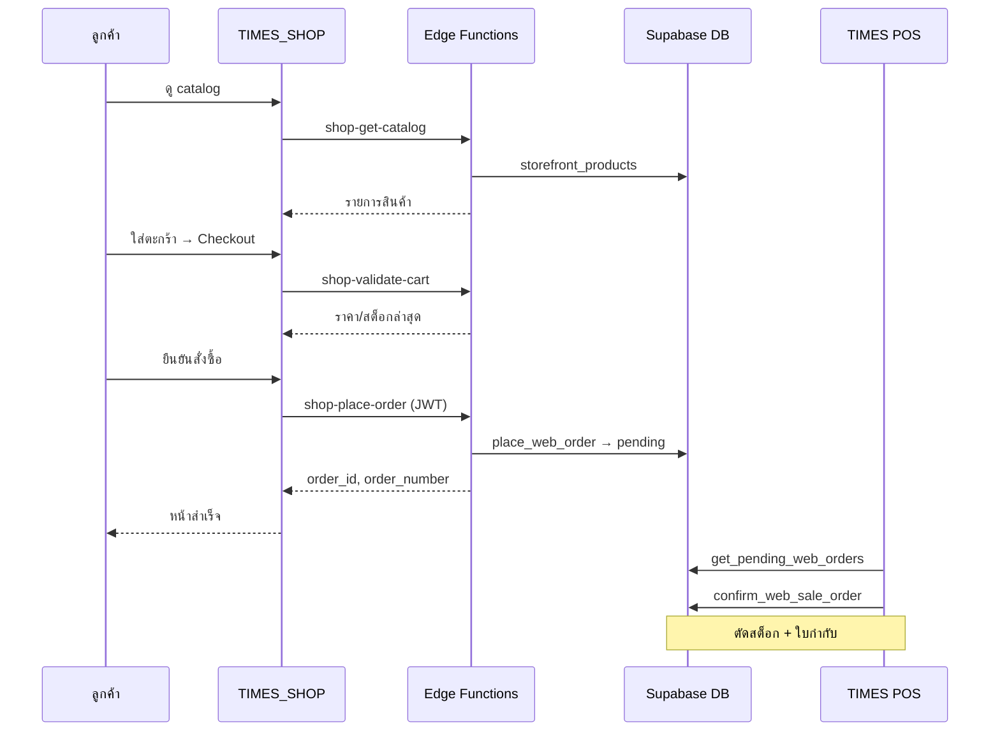

# TIMES_SHOP — Product Requirements (PRD)

> เว็บขายสินค้าสำหรับลูกค้าทั่วไป — repo แยกจาก TIMES_POS  
> Backend: Supabase project เดียวกับ POS  
> อัปเดต: มิ.ย. 2026

---

## 1. บริบท

**TIMES POS** เป็นระบบ POS สำหรับร้านนาฬิกา (React + Supabase) ที่มีการเชื่อม **TikTok Shop API** ครบวงจรแล้ว — import ออเดอร์, จับคู่ SKU, mirror สต็อก, ยืนยันที่แคชเชียร์

**TIMES_SHOP** คือเว็บร้านค้า **TIMES STORE** สำหรับ **ลูกค้าทั่วไป** ให้สั่งซื้อได้เองครบจบ โดย:

- สินค้า (ชื่อ, SKU, ราคา, สต็อก) sync จาก **TikTok Shop API** ผ่าน backend ที่มีอยู่
- ออเดอร์จากเว็บเข้า **คิวรอยืนยันที่ POS** เหมือน "ออเดอร์ TikTok รอยืนยัน"
- ลูกค้ามีบัญชีของตัวเอง (email/password หรือ Google)
- Admin จัดการคูปอง / banner โปรโมชั่นได้

---

## 2. เป้าหมาย

| เป้าหมาย | วัดความสำเร็จ |
|----------|---------------|
| ลูกค้าสั่งซื้อเองได้โดยไม่ต้องพึ่ง admin | checkout ครบ flow บนเว็บ |
| ข้อมูลสินค้าตรง TikTok | ราคา/ชื่อ/สต็อก validate ก่อนชำระ |
| ออเดอร์เข้า POS พร้อมยืนยัน | โผล่ในคิว pending พร้อมรายละเอียดครบ |
| ปลอดภัย | ลูกค้าเข้า POS / cost_price / ออเดอร์คนอื่นไม่ได้ |

---

## 3. ผู้ใช้ (Personas)

### 3.1 ลูกค้า (role: `customer`)

- ดู catalog, ค้นหา, กรอง (ถ้ามี)
- ตะกร้า: เพิ่ม/ลด/ลบ SKU
- Checkout: กรอกข้อมูลจัดส่ง + เลือกวิธีชำระ
- สมัคร / login (email+password, Google)
- บันทึกที่อยู่หลายที่ — เลือกใช้ซ้ำ
- ดูประวัติออเดอร์ของตัวเอง + สถานะ

### 3.2 Admin ร้าน (role: `admin` / `super_admin` — ใช้ auth เดิม POS)

- **สินค้า:** เปิด/ปิด/ลบ SKU บนเว็บ (sync ทุก SKU จาก TikTok เป็นค่าเริ่มต้น)
- **บัญชีธนาคาร:** เพิ่ม/แก้/ลบบัญชีรับโอน (ใส่ข้อมูลภายหลังได้)
- **สลิปโอนเงิน:** คิว `pending_review` — **อนุมัติ/ปฏิเสธด้วยตา** (ไม่ใช้ OCR)
- สร้าง/แก้/ปิด **คูปอง** (Phase 2)
- อัปโหลด/เปลี่ยน **banner / popup โปรโมชั่น** (Phase 2)

### 3.3 พนักงาน POS (ไม่ใช้ Shop)

- ยืนยันออเดอร์ web ที่หน้า POS (ขยายจาก TikTokConfirmPanel)
- ไม่เปลี่ยน flow ยืนยัน: จับคู่ SKU → ตรวจสอบ → net_received → confirm

---

## 4. ขอบเขตฟีเจอร์

### Phase 1 — MVP (ต้องมีก่อน launch)

#### 4.1 Catalog

- [ ] แสดงรายการสินค้าจาก TikTok SKU (ผ่าน `shop-get-catalog`)
- [ ] แต่ละรายการ: รูป, ชื่อสินค้า, ชื่อ SKU/variant, ราคา, สถานะสต็อก (มี/หมด/เหลือ n)
- [ ] หน้ารายละเอียดสินค้า (PDP)
- [ ] ค้นหาชื่อ / SKU
- [ ] Pagination หรือ infinite scroll
- [ ] Desktop + Mobile responsive

**Sync สินค้า:**

- Sync **ทุก SKU จาก TikTok** → `storefront_products` (`is_published = true` เป็นค่าเริ่มต้น)
- Admin ใน `/admin` **เปิด / ปิด / ลบ** SKU บนเว็บได้ (ลบ = soft-delete ไม่แสดงใน catalog)
- Backend cache (cron ทุก 5–15 นาที จาก TikTok API)
- **สต็อกบนเว็บ = TikTok qty อย่างเดียว** (ไม่อิง POS `current_stock`)
- ตะกร้า / checkout: เรียก `shop-validate-cart` เพื่อ refresh ราคาและสต็อกก่อนชำระ
- ถ้าราคาเปลี่ยนระหว่าง checkout → แจ้งลูกค้าให้ยืนยันราคาใหม่

#### 4.2 ตะกร้า (Cart)

- [ ] เก็บใน localStorage (guest) + merge เมื่อ login (optional Phase 1.5)
- [ ] แก้จำนวน SKU ในตะกร้าเดิม
- [ ] เพิ่ม SKU ใหม่
- [ ] ลบรายการ
- [ ] แสดงยอดรวมชั่วคราว (client-side) + validate กับ server ก่อนชำระ

#### 4.3 Checkout

- [ ] ฟิลด์บังคับ:
  - ชื่อผู้รับ
  - เบอร์โทร
  - ที่อยู่จัดส่ง (บ้านเลขที่, แขวง/ตำบล, เขต/อำเภอ, จังหวัด, รหัสไปรษณีย์)
  - หมายเหตุจัดส่ง (optional)
- [ ] เลือกที่อยู่ที่บันทึกไว้ (ถ้า login แล้ว)
- [ ] **เลือกวิธีชำระเงิน** (ลูกค้าเลือกได้ — ไม่มี default บังคับ):
  - **COD** — เก็บเงินปลายทาง
  - **โอนเงิน** — แสดงบัญชีธนาคารจาก admin + **อัปโหลดสลิปใน checkout (บังคับ)** ก่อนสั่งซื้อ
- [ ] **โอนเงิน — อัปโหลดสลิป (MVP):**
  - รับไฟล์ JPG/PNG/PDF, ขนาดจำกัด (เช่น ≤ 5MB)
  - `shop-verify-slip`: ตรวจเฉพาะไฟล์ valid (MIME, ขนาด) — **ไม่ใช้ OCR บริการเสียเงิน**
  - สถานะสลิป: `pending_review` → admin **อนุมัติ/ปฏิเสธ** ใน `/admin` (ตรวจมือเป็นหลัก)
  - POS ยืนยันออเดอร์โอนได้หลัง admin อนุมัติสลิป (แนะนำ)
- [ ] **ค่าจัดส่ง: ส่งฟรี** — แสดง "ส่งฟรี" ใน cart/checkout, `shipping_fee = 0`
- [ ] สรุปรายการ + ยอดสุทธิ
- [ ] กด "ยืนยันสั่งซื้อ" → `shop-place-order` (`payment_method`: `cod` | `transfer` + `slip` ถ้าโอน)

#### 4.4 บัญชีลูกค้า

- [ ] Sign up: email + password — **ไม่บังคับ confirm email ก่อนสั่งซื้อ** (ปิด Confirm email ใน Supabase Auth)
- [ ] Sign in / Sign out
- [ ] Sign in with Google — **UI + code พร้อม MVP** (ยังไม่มี OAuth client → ปุ่มแสดงพร้อมคู่มือตั้งค่า / disabled จนกว่าจะ config ใน Supabase)
- [ ] หน้า Profile: ชื่อที่แสดง, เบอร์ default
- [ ] จัดการที่อยู่: เพิ่ม / แก้ / ลบ / ตั้ง default
- [ ] ประวัติออเดอร์: วันที่, เลขที่, สถานะ, ยอด, รายการสินค้า

#### 4.5 หลังสั่งซื้อ

- [ ] หน้า "สั่งซื้อสำเร็จ" + เลขที่ออเดอร์
- [ ] (ไม่บังคับ) อีเมลยืนยันคำสั่งซื้อ — Phase 1.5
- [ ] ออเดอร์เข้า POS คิว **รอยืนยัน** (`sale_orders.status = 'pending'`, `channel = 'web'`)

#### 4.7 Admin `/admin` (MVP — บางส่วน)

- [ ] **สินค้า:** รายการ SKU ทั้งหมด — เปิด/ปิด (`is_published`) / ลบ (soft-delete)
- [ ] **บัญชีธนาคาร:** CRUD บัญชีรับโอน (ว่างได้ตอนเริ่ม — admin ใส่ทีหลัง)
- [ ] **สลิป:** คิว `pending_review` — admin ตรวจมือ อนุมัติ/ปฏิเสธ
- [ ] คูปอง / banner — Phase 2

#### 4.8 POS Integration (ทำใน TIMES_POS — ดู BACKEND_TODO.md)

- [ ] แสดงออเดอร์ web ในคิว pending (badge + รายการ + ลิงก์สลิปถ้าโอน)
- [ ] ยืนยันออเดอร์ → ตัดสต็อก POS + ใบกำกับ (สต็อกที่แสดงบนเว็บ = TikTok; POS ตัดสต็อกของตัวเองตอน confirm)

---

### Phase 2 — การตลาด

- [ ] **คูปอง:** code, ส่วนลด %, ส่วนลดบาท, ขั้นต่ำ, วันเริ่ม–หมดอายุ, จำกัดจำนวนครั้ง
- [ ] **Banner:** แถบด้านบน / hero หน้าแรก
- [ ] **Popup โปรโมชั่น:** แสดงครั้งแรก / ตาม schedule
- [ ] Admin UI จัดการ promo ที่ **`/admin` ใน TIMES_SHOP** (admin login ด้วย role เดิมจาก POS)

---

### Phase 3 — เพิ่มเติม (Out of scope MVP)

- Payment gateway (2C2P, Omise, etc.)
- ลูกค้าแก้ออเดอร์หลังสั่ง
- Shopee / Lazada storefront
- Live chat / LINE OA integration
- Review / rating สินค้า

---

## 5. Flow หลัก

### 5.1 สั่งซื้อ



### 5.2 TikTok SKU เปลี่ยนระหว่างอยู่ในตะกร้า

1. ลูกค้าเปิดตะกร้า / กด checkout
2. Shop เรียก `shop-validate-cart` ทุกครั้ง
3. Server เปรียบเทียบ `unit_price`, `stock_available` กับที่ client ส่งมา
4. ถ้าไม่ตรง → ส่ง `price_changed: true` / `stock_insufficient: true` + ค่าใหม่
5. UI แสดง diff ให้ลูกค้ายืนยันก่อนดำเนินการต่อ

---

## 6. ข้อกำหนดข้อมูล

### 6.1 สินค้าที่แสดงบนเว็บ

| Field | แหล่ง | แสดงลูกค้า |
|-------|-------|------------|
| `tiktok_sku_id` | TikTok | ใช้ internal / URL |
| `product_name` | TikTok / cache | ✅ |
| `sku_name` | TikTok | ✅ |
| `image_url` | TikTok | ✅ |
| `unit_price` | TikTok `sale_price` / `sku_sale_price` | ✅ |
| `stock_available` | **TikTok qty อย่างเดียว** | ✅ |
| `is_published` | Admin เปิด/ปิด; default `true` เมื่อ sync | admin |
| `deleted_at` | Admin ลบ (soft-delete) | admin |
| `cost_price` | POS | ❌ ห้าม |
| `seller_sku` | TikTok | optional แสดง |

### 6.2 ออเดอร์ web

| Field | เก็บที่ |
|-------|---------|
| `channel` | `'web'` |
| `status` | `'pending'` → POS confirm → `'active'` |
| `customer_user_id` | `auth.users.id` |
| `shipping_*` | คอลัมน์เดิม `sale_orders` |
| `web_order_number` | ใหม่ — เช่น `WEB-20260615-001` |
| line items | `sale_order_items` + `tiktok_sku_id` |

---

## 7. Tech Stack (TIMES_SHOP)

| ชั้น | เทคโนโลยี |
|------|-----------|
| Frontend | Vite 5 + React 18 + Tailwind CSS 3 |
| Auth | Supabase Auth (@supabase/supabase-js) |
| API | Supabase Edge Functions (BFF) — ไม่เรียก TikTok จาก browser |
| Deploy | GitHub Pages via **GitHub Actions** — `base: '/TIMES_SHOP/'` |
| ชื่อร้าน | **TIMES STORE** (โลโก้ใส่ทีหลัง) |
| Test | Vitest (optional Phase 1) |
| ภาษา UI | ไทยเป็นหลัก |

**ห้ามใช้:** Next.js (ไม่จำเป็น), สร้าง Supabase project ใหม่, copy `main.jsx` จาก POS

---

## 8. Deploy & URLs

| รายการ | URL |
|--------|-----|
| **TIMES_SHOP (production)** | https://evasi0m.github.io/TIMES_SHOP/ |
| **TIMES_POS (production)** | https://evasi0m.github.io/TIMES_POS/ |
| **Deploy Shop** | GitHub Pages — **GitHub Actions** (Settings → Pages → Build and deployment → GitHub Actions) |
| **Vite base path** | `base: '/TIMES_SHOP/'` (subpath deploy) |
| **OAuth redirect (Google)** | `https://evasi0m.github.io/TIMES_SHOP/` (+ path callback ตาม router) |
| **CORS `SHOP_ALLOWED_ORIGINS`** | `https://evasi0m.github.io`, `http://localhost:5173` |
| **GitHub repo (อ้างอิง)** | `github.com/evasi0m/TIMES_POS`, `github.com/evasi0m/TIMES_SHOP` |

---

## 9. UI/UX

- ชื่อร้าน: **TIMES STORE** (โลโก้ Phase 2)
- โทนสี cream + coral — ดู [UI_GUIDE.md](./UI_GUIDE.md)
- Mobile-first, touch 44px, แสดง **ส่งฟรี** ใน cart/checkout
- Admin `/admin`: glass UI แนว TikTok tab

---

## 10. ความปลอดภัย (สรุป — รายละเอียดใน SECURITY.md)

- ลูกค้า role `customer` — แยกจาก staff roles
- Shop เรียก API ผ่าน Edge Functions เท่านั้น
- ห้าม query ตาราง POS โดยตรงจาก browser ลูกค้า
- สลิปโอนเงิน: Storage bucket private + signed URL

---

## 11. เกณฑ์ยอมรับ (Acceptance Criteria) — MVP

- [ ] signup/login email **โดยไม่ต้อง verify email ก่อนสั่งซื้อ**
- [ ] catalog จาก TikTok (ราคา + สต็อก TikTok)
- [ ] admin เปิด/ปิด/ลบ SKU ใน `/admin`
- [ ] checkout COD หรือโอน + อัปโหลดสลิป (โอน) → admin ตรวจมือ
- [ ] ส่งฟรีทุกออเดอร์
- [ ] admin ตั้งบัญชีธนาคาร (ว่างตอนแรกได้)
- [ ] ออเดอร์เข้า POS pending (+ สลิปถ้าโอน)
- [ ] deploy https://evasi0m.github.io/TIMES_SHOP/ via GitHub Actions

---

## 12. การตัดสินใจแล้ว (ครบ)

| # | หัวข้อ | การตัดสินใจ |
|---|--------|-------------|
| Q1 | ชำระเงิน | **COD + โอน** — ลูกค้าเลือกเอง |
| Q2 | ราคา | **TikTok** |
| Q3/Q12 | สต็อก | **TikTok qty อย่างเดียว** |
| Q4 | Deploy | **https://evasi0m.github.io/TIMES_SHOP/** · GitHub Pages + **GitHub Actions** |
| Q5 | Admin | **`/admin` ใน Shop** |
| Q6 | โอนเงิน | บัญชีใน **admin** · **แนบสลิป checkout** · **admin ตรวจมือ** (ไม่มี OCR) |
| Q7 | Branding | **TIMES STORE** · logo ทีหลัง |
| Q8 | URLs | Shop + POS บน `evasi0m.github.io` |
| Q9 | จัดส่ง | **ส่งฟรี** |
| Q10 | สินค้า | **ทุก SKU TikTok** · admin เปิด/ปิด/ลบ |
| Q11 | Google | **MVP รองรับ code** · OAuth client config ทีหลัง |
| Q13 | **OCR สลิป** | **ไม่ใช้บริการเสียเงิน** — admin ตรวจสลิปมือใน `/admin` |
| Q14 | **Confirm email** | **ไม่บังคับ** — สมัครแล้วสั่งซื้อได้เลย |

### สต็อก (Q3)

```sql
stock_available = tiktok_qty
```

POS confirm ยังตัดสต็อก POS — อาจไม่ตรงกับที่แสดงบนเว็บ (ตาม policy)

### โอนเงิน (Q6 / Q13)

- `shop_bank_accounts` — admin CRUD
- สลิป → `payment-slips/` → `shop-verify-slip` (ตรวจไฟล์เท่านั้น) → `pending_review`
- Admin อนุมัติ/ปฏิเสธใน `/admin` — **ไม่มี OCR อัตโนมัติ**
- POS ดูสลิป + สถานะ admin ก่อน confirm

### Auth (Q14)

- Supabase Dashboard → Authentication → Providers → Email → **ปิด "Confirm email"**
- ลูกค้า `signUp` แล้ว checkout ได้ทันที (session มี JWT)

---

## 13. เอกสารที่เกี่ยวข้อง

- [BACKEND_CONTRACT.md](./BACKEND_CONTRACT.md) — API spec
- [BACKEND_TODO.md](./BACKEND_TODO.md) — งานฝั่ง POS
- [SECURITY.md](./SECURITY.md)
- [UI_GUIDE.md](./UI_GUIDE.md)
- TIMES_POS: `docs/TIKTOK_POS_API_REFERENCE.md`
